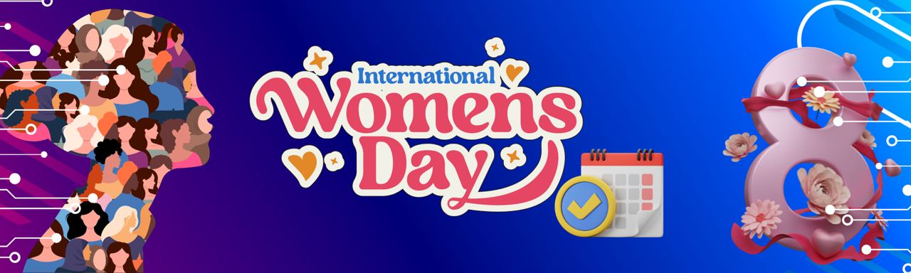

# Women's March: Celebrating International Women's Day

This repository serves as a comprehensive collection of events commemorating International Women's Day throughout the month of March. Whether it's gatherings, workshops, seminars, or online discussions, this repository aims to centralize information on diverse celebrations worldwide. Contributions from individuals and organizations are encouraged to expand the repository and ensure inclusivity in highlighting women's achievements, struggles, and progress.

If you are interested in adding an event, kindly read our [contribution guidelines](https://github.com/DennyPerez18/Women-March/blob/main/CONTRIBUTING.md).

## Events
